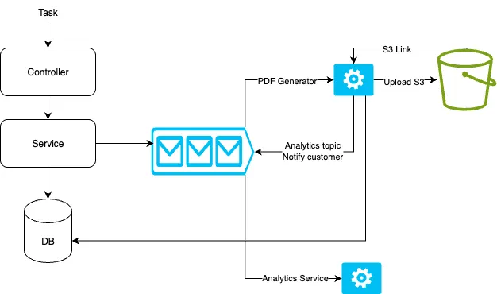

# Go Fiber REST API

A modern REST API built with Go Fiber framework, featuring hot reloading, containerization, and a complete development environment.

## Features

- 🚀 **Go Fiber** - Fast HTTP framework
- 🔥 **Hot Reloading** - Development with Air
- 🐳 **Docker** - Containerized development and production
- 🗄️ **MySQL 8** - Database
- 📦 **Redis** - Caching
- 🔍 **Redis Insight** - Redis GUI
- 📊 **Kafka** - Message broker
- 🎛️ **Kafka UI** - Kafka dashboard
- 🛠️ **Adminer** - Database management

## Architecture
High level overview: 

## Quick Start

### Prerequisites

- Docker & Docker Compose
- Go 1.25

### Development Environment

1. **Clone and start the development environment:**

   ```bash
   # Using Make
   make dev

   # Or using Docker Compose directly
   docker-compose up --build
   ```

2. **Access the services:**
   - **API**: http://localhost:8080
   - **Redis Insight**: http://localhost:8001
   - **Kafka UI**: http://localhost:8080 (Note: conflicts with API, see note below)
   - **Adminer**: http://localhost:8082

> **Note**: Kafka UI and the API both use port 8080. To avoid conflicts, you can modify the Kafka UI port in `docker-compose.yml` to something like `8083:8080`.

### Production Environment

```bash
# Using Make
make prod

# Or using Docker Compose directly
docker-compose -f docker-compose.prod.yml up --build
```

## Available Commands

### Using Make

```bash
# Development
make dev          # Start development environment
make dev-d        # Start development environment in detached mode

# Production
make prod         # Start production environment
make prod-d       # Start production environment in detached mode

# Management
make stop         # Stop all containers
make restart      # Restart all containers
make clean        # Clean up containers and volumes
make clean-all    # Clean up everything including images

# Logs
make logs         # Show all logs
make logs-app     # Show API logs
make logs-mysql   # Show MySQL logs
make logs-redis   # Show Redis logs
make logs-kafka   # Show Kafka logs

# Database
make db-connect   # Connect to MySQL database
make redis-cli    # Connect to Redis CLI

# Local development
make install-air  # Install Air for hot reloading
make air          # Run with Air locally
make run          # Run locally without Air
make test         # Run tests
```

### Using Docker Compose directly

```bash
# Development
docker-compose up --build
docker-compose up --build -d  # detached mode

# Production
docker-compose -f docker-compose.prod.yml up --build

# Stop
docker-compose down

# View logs
docker-compose logs -f [service-name]
```

## Environment Variables

The application uses the following environment variables (automatically set in Docker Compose):

```bash
# Database
DB_HOST=mysql
DB_PORT=3306
DB_USER=root
DB_PASSWORD=rootpassword
DB_NAME=fiber_db

# Redis
REDIS_HOST=redis
REDIS_PORT=6379

# Kafka
KAFKA_BROKERS=kafka:9092

# Environment
ENV=development  # or production
```

## Project Structure

```
.
├── .air.toml              # Air configuration for hot reloading
├── .gitignore             # Git ignore rules
├── Dockerfile             # Production Dockerfile
├── Dockerfile.dev         # Development Dockerfile with Air
├── docker-compose.yml     # Development environment
├── docker-compose.prod.yml # Production environment
├── Makefile              # Convenient commands
├── go.mod                # Go modules
├── go.sum                # Go modules checksum
├── main.go               # Application entry point
├── scripts/
│   └── init.sql          # Database initialization
└── README.md             # This file
```

## Database Access

### MySQL Connection Details

- **Host**: localhost (when running locally) or mysql (within Docker network)
- **Port**: 3306
- **Username**: root
- **Password**: rootpassword
- **Database**: fiber_db

### Using Adminer

1. Open http://localhost:8082
2. Select "MySQL" as the system
3. Enter the connection details above

### Command Line Access

```bash
# Connect to MySQL
make db-connect

# Or using Docker directly
docker exec -it mysql-db mysql -u root -prootpassword fiber_db
```

## Redis Access

### Redis Insight

1. Open http://localhost:8001
2. Add a new database with:
   - **Host**: redis (or localhost if accessing from outside Docker)
   - **Port**: 6379

### Command Line Access

```bash
# Connect to Redis CLI
make redis-cli

# Or using Docker directly
docker exec -it redis-cache redis-cli
```

## Kafka

### Kafka UI

Access the Kafka dashboard at http://localhost:8080 (you may need to change this port to avoid conflicts).

### Topics

You can create and manage Kafka topics through the UI or programmatically in your Go application.

## Hot Reloading

The development environment uses [Air](https://github.com/air-verse/air) for hot reloading. Any changes to your Go files will automatically rebuild and restart the application.

### Air Configuration

The `.air.toml` file contains the configuration for Air, including:

- File watching patterns
- Build commands
- Exclusion rules

## Development Tips

1. **Volume Mounting**: Your source code is mounted into the container, so changes are reflected immediately.
2. **Debugging**: You can attach debuggers to the running container on port 8080.
3. **Database Persistence**: Database data is persisted in Docker volumes.
4. **Log Monitoring**: Use `make logs` or `make logs-app` to monitor application logs.

## Customization

- Modify `docker-compose.yml` for development environment changes
- Modify `docker-compose.prod.yml` for production environment changes
- Update `.air.toml` for Air configuration changes
- Edit `scripts/init.sql` for database initialization changes

## Troubleshooting

1. **Port Conflicts**: If you have services running on the same ports, modify the port mappings in the Docker Compose files.
2. **Volume Issues**: If you encounter volume-related issues, try `make clean` to remove volumes and restart.
3. **Hot Reloading Not Working**: Ensure your code changes are being saved and check the Air logs with `make logs-app`.

## Contributing

1. Fork the repository
2. Create a feature branch
3. Make your changes
4. Test with the development environment
5. Submit a pull request
